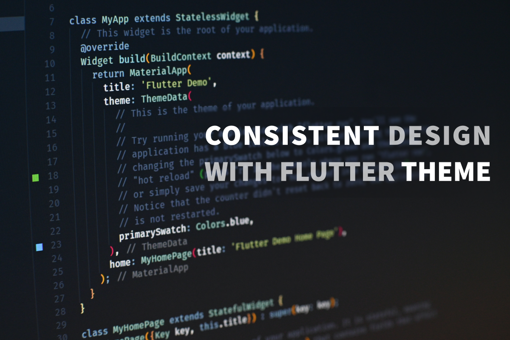

# Consistent design with Flutter Theme

Source code for the "Consistent design with Flutter Theme" DartPad workshop by [Anna Leushchenko 👩‍💻💙📱🇺🇦](https://github.com/foxanna) 

> Consistency is a winning strategy for a good application UI. And Flutter developers don’t have to be professional designers to achieve it. As usual, there is a widget for that - Theme! Find more details about effortless consistent Flutter application design in this workshop.

[View in DartPad](https://dartpad.dev/workshops.html?webserver=https://raw.githubusercontent.com/foxanna/flutter_theme_workshop/main/workshop)

